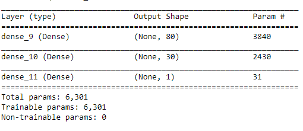
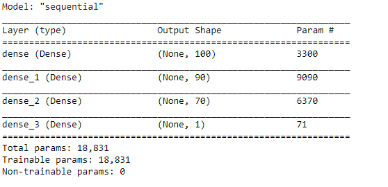
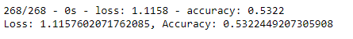
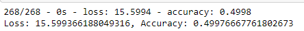

# Neural_Network_Charity_Analysis

## Overview
I am going to work to help the foundation predict where to make investments.
From Alphabet Soup’s business team, There are more than 34,000 organizations that have received funding from Alphabet Soup over the years.

## Result
I am going to the features in the provided dataset to help Beks create a binary classifier that is capable of predicting whether applicants will be successful if funded by Alphabet Soup.

### Data Preprocessing
What variable(s) are considered the target(s) for your model?
 - IS_SUCCESSSFUL is the target.

What variable(s) are considered to be the features for your model?
 - for the first model, except IS_SUCCESSSFUL which is the target, I also exclude EIN and NAME.
 - for the second model, except IS_SUCCESSSFUL which is the target, I exclude EIN, NAME add ASK_AMOUNT

What variable(s) are neither targets nor features, and should be removed from the input data?
  - EIN and NAME are removed.
  - EIN, NAME add ASK_AMOUNT are removed.

- Compiling, Training, and Evaluating the Model

- For the first model, I set 2 hidden layers, for which I use ReLu activiation function. I set sigmoid for the output layer.

- For the second model, I set 3 hidden layers, for which I use ReLu activiation function. I set sigmoid for the output layer.

- Were you able to achieve the target model performance?

 - The performance is around 0.5, which is not very good.
 
 - The performance is still around 0.5 after optimization.

### What steps did you take to try and increase model performance?

 - try to eliminate categorical levels with extreme low frequency.
 - drop ASK_AMOUNT
 - add one extra hidden layer
 - add one extra neuron

## Summary

Above all, the model has a fairly well accuracy at 0.5. It is better to use random forest.
